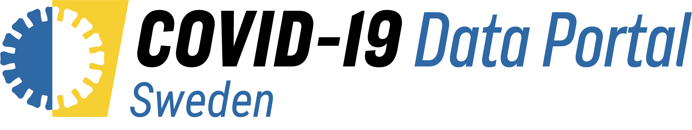

# 

## COVID-19 Data Portal Sweden

This is the source code for the Swedish CCOVID-19 Data Portal:
[https://www.covid19dataportal.se/](https://www.covid19dataportal.se/)

The website is the Swedish node for the European Covid-19 Data Portal project.
The main European site can be seen at [https://www.covid19dataportal.org/](https://www.covid19dataportal.org/)

- [Introduction](#introduction)
- [Development](#development)
    - [Step 1: Access the code](#step-1-access-the-code)
    - [Step 2a: Edit the files (online)](#step-2a-edit-the-files-online)
    - [Step 2b: Edit the files (locally)](#step-2b-edit-the-files-locally)
    - [Step 3: Make a pull request](#step-3-make-a-pull-request)
- [How to get help](#how-to-get-help)
- [Credits](#credits)

## Introduction

This website is developed for [Vetenskapsrådet](https://www.vr.se/) by the [SciLifeLab Data Centre](https://www.scilifelab.se/data/).
It is intended to provide a central place to provide information about:

- Available COVID-19 datasets
- Support services for COVID-19 researchers
- Information and support for publishing and sharing COVID-19 datasets
- Ongoing research projects and funding opportunities for COVID-19 research

The site is built using the [Hugo](https://gohugo.io/) static web site generator.
It uses the [Bootstrap](https://getbootstrap.com/) framework. In addition, it uses [Vega-Lite](https://vega.github.io/vega-lite/), [DataTables](https://datatables.net/), [Select2](https://select2.org/), [OpenLayers](https://openlayers.org/), [plotly](https://plotly.com/), [ImJoy](https://imjoy.io/).

## Development

All website content is written in [Markdown](https://guides.github.com/features/mastering-markdown/), and so relatively easy to edit.

### Step 1: Access the code

The code is hosted on [GitHub](http://github.com/), so you'll need an account.

Next, visit the code repository: [https://github.com/ScilifelabDataCentre/covid-portal](https://github.com/ScilifelabDataCentre/covid-portal)

In the top right, you'll see a button that says _"Fork"_. Click this, then select your username.
This makes a copy of the repository under your personal account that you can edit.

### Step 2a: Edit the files (online)

> This is best if you only want to make one or two minor tweaks.
> If you want to make more substantial edits over a longer time frame, we recommend editing locally (_Step 2b_).

The easiest way to edit the website files is on the GitHub website.

On the web page of your _forked_ copy of the repository, look in the `content/` directory.
Each subdirectory contains the website contents in English or Swedish.

The filenames correspond to the website URL:

- [https://www.covid19dataportal.se/data_types/protein_data/services/](https://www.covid19dataportal.se/data_types/protein_data/services/)
    - `content/english/data_types/protein_data/services.md`
- [https://www.covid19dataportal.se/sv/data_types/protein_data/](https://www.covid19dataportal.se/sv/data_types/protein_data/)
    - `content/svenska/data_types/protein_data/_index.md`

Go to the markdown file that you want to edit, then click the Pencil icon :pencil2: in the top right.
This opens a web-based editor where you can add and edit content.

When you're finished, scroll to the bottom and fill in / submit the _"Commit changes"_ form.

You're nearly done - you can now skip to _Step 3_.

### Step 2b: Edit the files (locally)

#### Git setup

If you prefer, you can edit the website files on your computer in your favourite text editor.
Just fork the repository to your machine:

```bash
git clone git@github.com:[YOUR-USERNAME]/covid-portal.git
cd covid-portal
```

To make it easier to pull in changes made by others, you can add the main repository as a remote:

```bash
git remote add upstream https://github.com/ScilifelabDataCentre/covid-portal.git
```

Then you can fetch changes at any time from this remote:

```bash
git pull upstream develop
```

When you have finished editing, commit and push to your fork:

```bash
git add .
git commit -m "My changes"
git push
```

#### Testing locally

To view your changes as they will appear in the final website, you need to install Hugo.
You can find instructions on the Hugo website: [https://gohugo.io/](https://gohugo.io/)

If you're using Mac OSX, it's recommended to use [Homebrew](https://brew.sh/) -
if homebrew is already set up, installing Hugo is just a case of:

```bash
brew install hugo
```

Once Hugo is installed, simply run the following command in the repository root directory:

```console
$ hugo serve

                   | EN | SV
-------------------+----+-----
  Pages            | 34 | 34
  Paginator pages  |  0 |  0
  Non-page files   |  0 |  0
  Static files     | 26 | 26
  Processed images |  0 |  0
  Aliases          |  1 |  0
  Sitemaps         |  2 |  1
  Cleaned          |  0 |  0

Built in 123 ms
Watching for changes in /Users/philewels/GitHub/covid-portal/{archetypes,content,layouts,static}
Watching for config changes in /Users/philewels/GitHub/covid-portal/config.yaml
Environment: "development"
Serving pages from memory
Running in Fast Render Mode. For full rebuilds on change: hugo server --disableFastRender
Web Server is available at http://localhost:1313/ (bind address 127.0.0.1)
Press Ctrl+C to stop
```

Use the URL printed at the bottom of this message (here, it's `http://localhost:1313/`) to view the site.
Every time you save a file, the page will automatically refresh in the browser.

#### Docker

If you would prefer not to use Hugo, you can use the provided Dockerfile to build and run a container.

### Step 3: Make a pull request

Once you're finished with your edits and they are committed and pushed to your forked repository, it's time to open a pull request.

You can find full documentation on the [GitHub help website](https://help.github.com/en/github/collaborating-with-issues-and-pull-requests/about-pull-requests), however in short:

- Visit the main repository: [https://github.com/ScilifelabDataCentre/covid-portal](https://github.com/ScilifelabDataCentre/covid-portal)
- Click the button that reads _"New Pull Request"_
- Click the text link near the top that says _"compare across forks"_
- In the right-hand _"head repository"_ drop down, select your username / fork.
- If you're happy with the list of commits shown, and the diff in the _"Files Changed"_ tab, fill in a title and description and click _"Create pull request"_

Once created, a member of the website team will review your changes.
Once approved, they will be merged and deployed.

## Using ImJoy Plugins

This website supports [ImJoy](https://imjoy.io) plugins which can be used to visualize, annotate, run analysis directly from the website. Please see the file CONTRIBUTING/ImJoy.md for examples of usage.

## Adding data highlights

Data highlights section of the portal works based on a number of custom functions. We therefore wrote instructions on how to add new data highlights, please see the CONTRIBUTING folder.

## How to get help

If in doubt, you can ask for help on the [`#covid-19-data-portal`](https://scilifelab.slack.com/archives/C012X6S0D3N) channel on the SciLifeLab Slack, or email [datacentre@scilifelab.se](mailto:datacentre@scilifelab.se).

## Credits

The website was built by [SciLifeLab Data Centre](https://www.scilifelab.se/data/) with the help of some additional SciLifeLab volunteers.

The primary contributors have been:

- [@pekrau](http://github.com/pekrau/): Project leader
- [@akochari](http://github.com/akochari/): Project manager/web developer
- [@ewels](https://github.com/ewels): Built the website
- [@talavis](https://github.com/talavis): Server setup and more
