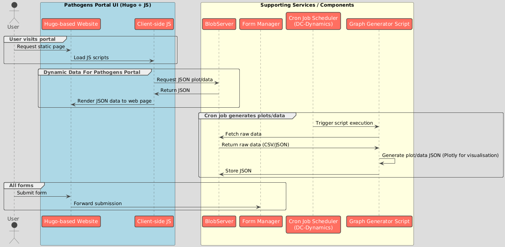
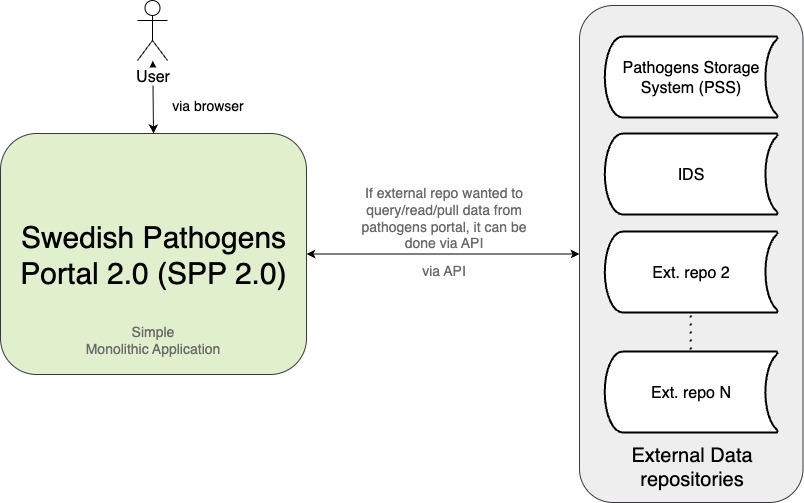

# 2. Pathogens Portal 2.0 Architecture

## Status

Draft

## Context

The Pathogens Portal is Sweden’s national platform for sharing and accessing research outputs related to infectious diseases.

### Core Components

**Portal Website:**
- The Hugo frontend and JavaScript-based dynamic rendering are encapsulated into a single delivery unit that presents content to users via static builds and runtime data loading.

**Supporting Services:**
- BlobServer: Stores and serves raw and processed data
- Form Manager: Handles user-submitted forms
- DC-Dynamics: Orchestrates scheduled job execution
- Graph Generator (Python-Scripts): Processes data and generates visualizations

### Component Interactions & Information Flow

*Figure 1: Service-level information flow*

### Workflows to Update Content
- **Static content**: Manual edits by Team Freya with direct deployment
- **Dynamic data**: Users upload raw data to BlobServer. Team Freya then configures automated scripts and cron jobs to transform and visualize the data.

*Figure 2: User interaction workflows for updating content/data*

### Motivation for Pathogens Portal 2.0

The current Pathogens Portal architecture, while functional, has several limitations that necessitate a move towards a more dynamic, flexible, and scalable system:

#### Current Limitations

1. **Manual Content Management**: Static content updates require direct code changes and deployment by Team Freya, creating bottlenecks and delays
2. **Limited User Engagement**: Users cannot directly contribute or suggest content updates through the platform
3. **Scalability Issues**: The current workflow doesn't scale well for handling multiple data contributors and diverse content types
4. **Limited Automation**: Data processing and visualization updates require manual intervention and script management

#### Need for Redesigning Pathogens Portal

The Pathogens Portal 2.0 aims to address these limitations by redesigning it from static website to dynamic web application. This transition will transform the portal from a static information repository into an active, community-driven platform that can better serve Sweden's infectious disease research community.

## Decision

We will transition the Pathogens Portal (internally known as Pathogens Portal 2.0) from a monolithic static architecture to a **service-oriented, modular web application**. This new architecture will be composed of independently deployable components with well-defined responsibilities, allowing the platform to scale in both functionality and usage.

*Figure 3: Pathogens Portal 2.0 architecture*

### Core Technology Stack

* **Frontend**: [Next.js](https://nextjs.org/)
  Responsible for rendering the user interface and interacting with APIs. Supports hybrid rendering (static and dynamic) and offers high performance for modern web delivery.

* **Backend**: [Django](https://www.djangoproject.com/)
  Acts as the system’s core, exposing APIs via Django REST Framework, handling authentication, business logic, and orchestrating integrations with external systems.

* **Database**: [PostgreSQL](https://www.postgresql.org/)
  Stores structured content, metadata, configuration data, and supports advanced querying through features like JSONB and full-text search.

* **External Services**:
  These services will be consumed either by the frontend or backend via APIs:

  * **Portal Storage Solution** (for data uploads and file access)
  * **Integrated Data Services (IDS)** (for harmonized metadata and research objects)
  * **External Repositories** (e.g., publication indexes, genomic data archives)

### Why This Architecture Approach?

We chose a **service-oriented architecture (SOA)** because it provides:

* **Loose coupling**: Components can evolve independently, enabling isolated deployments and targeted updates without affecting other system parts.
* **Improved scalability**: Each service can scale based on its own resource needs, supporting future growth in data volume and user traffic.
* **Separation of concerns**: Clean boundaries between UI, logic, and storage layers, facilitating easier maintenance and feature development.
* **Better integration**: External APIs can be consumed easily via backend orchestration or direct frontend queries, enabling seamless data pipeline integration.
* **AI/ML readiness**: Modular design supports easy integration of AI services, machine learning pipelines, and automated data processing workflows.
* **Future feature flexibility**: Architecture supports rapid prototyping and deployment of new features like real-time data visualization, collaborative tools, and advanced analytics.
* **Enhanced data pipeline integration**: Service boundaries allow for sophisticated ETL processes, data validation, and transformation workflows without impacting user-facing components.
* **Microservices evolution path**: Current SOA design provides a foundation for future migration to microservices if needed for advanced use cases.
* **API-first approach**: Enables multiple client types (web, mobile, third-party integrations) while maintaining consistent data access patterns.

This approach aligns with modern web development standards preparing the portal for more complex workflows and higher data integration.

### Why These Specific Technologies?

| Component    | Technology | Justification                                                                                                                                                                     |
| ------------ | ---------- | --------------------------------------------------------------------------------------------------------------------------------------------------------------------------------- |
| **Frontend** | Next.js    | Combines static and dynamic rendering, SEO-friendly, React-based, and widely supported. Flexible enough to handle dashboard-style applications and traditional content rendering. |
| **Backend**  | Django     | Secure, robust, and feature-rich with a built-in admin interface, powerful ORM, and mature REST tooling. Well known to the team and easy to maintain.                             |
| **Database** | PostgreSQL | Reliable, performant, and supports advanced features such as full-text search. Integrates seamlessly with Django ORM.                                            |

### Alternatives Considered

| Option                                               | Reason for Rejection                                                                                                                       |
| ---------------------------------------------------- | ------------------------------------------------------------------------------------------------------------------------------------------ |
| **Monolithic Django app** (Django + templates) | Creates tight coupling between frontend and backend, making it difficult to scale components independently, integrate external services, or implement modern frontend frameworks. Limits deployment flexibility, complicates third-party API integrations, and creates maintenance bottlenecks as the application grows. |
| **Headless CMS** (Strapi, Directus)                  | Adds operational overhead and limits customization in terms of workflows, data validation, and complex integrations.                       |
| **Continue with Hugo + JS + APIs**                   | Already showing scalability and maintainability limits. Poor support for dynamic workflows, user roles, and content contribution features. |
| **Node.js (Express)** for backend                    | More boilerplate, lacks built-in features like Django admin. Team familiarity is lower.                                                    |

This decision positions Pathogens Portal 2.0 for long-term maintainability and expansion, with the ability to support richer content, data interactivity, editorial workflows, and integration with SciLifeLab’s broader data infrastructure.

## Consequences

Adopting a service-oriented architecture (SOA) with decoupled frontend, backend, and database components introduces both **benefits** and **trade-offs**.

### Positive Outcomes

* **Improved Modularity**: Each component (frontend, backend, database) can be developed, tested, and deployed independently.
* **Scalable Design**: The system can scale horizontally by distributing workload across services, enabling better handling of increased user traffic or data volumes.
* **Future-Ready**: The architecture provides a strong foundation for supporting new features such as:

  * Automated content and data update workflows without requiring portal releases
  * AI-powered content summarization and intelligent data processing
  * Real-time or scheduled visualizations
  * Editorial workflows with automated publishing pipelines
  * Federated data integration via APIs
  * End-to-end automation from raw data ingestion to visualization generation
* **Flexible Integrations**: External systems like Portal Storage Solution, IDS, and domain-specific repositories can be plugged in with minimal effort.

### Risks & Challenges

* **Team Learning Curve**: The team will need to onboard onto **Next.js**, **React-based UI development**, and managing API interactions from the frontend.
* **SOA Implementation Complexity**: Adopting a service-oriented approach introduces new operational considerations such as:

  * Inter-service communication
  * Deployment coordination
  * Error handling and logging across services
* **Increased Initial Overhead**: Setting up infrastructure for independent services, CI/CD, and environment management will require initial investment of time and planning.

### Mitigation & Flexibility

* The architecture is **intentionally designed to evolve**. If certain design choices prove to be blockers (e.g., service boundaries, data flows, performance), the modular nature of the system allows adjustments without major rewrites.
* Initial implementation will **reproduce the existing features** of the current Pathogens Portal, ensuring continuity. As the team gains familiarity, the architecture will support gradual rollout of more advanced features.

